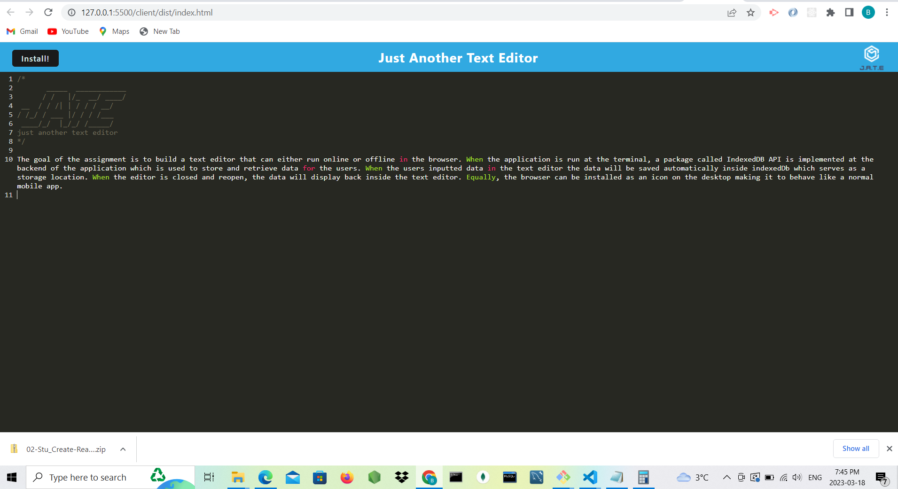
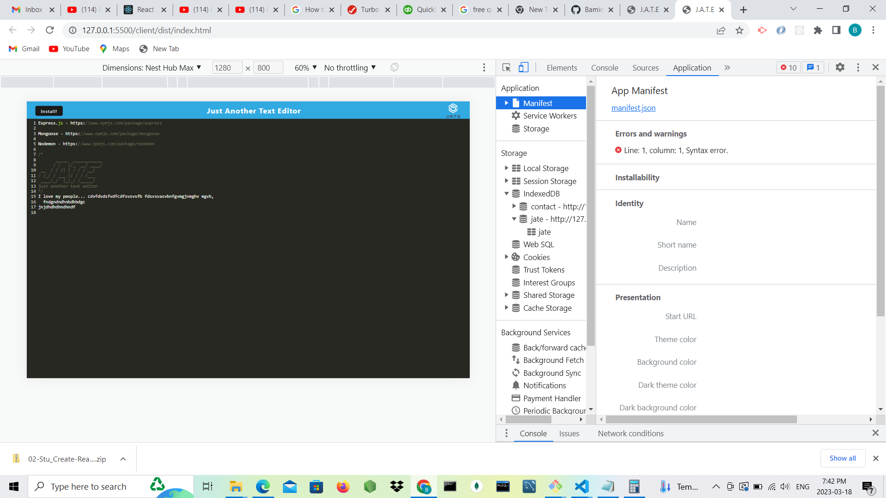
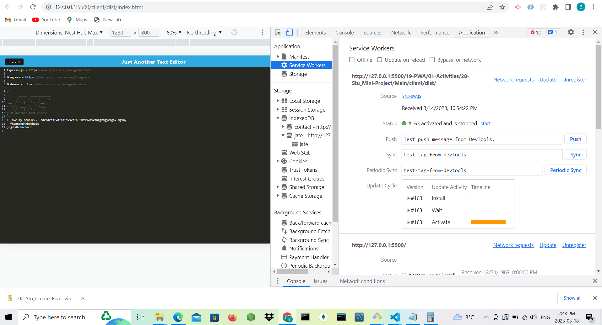
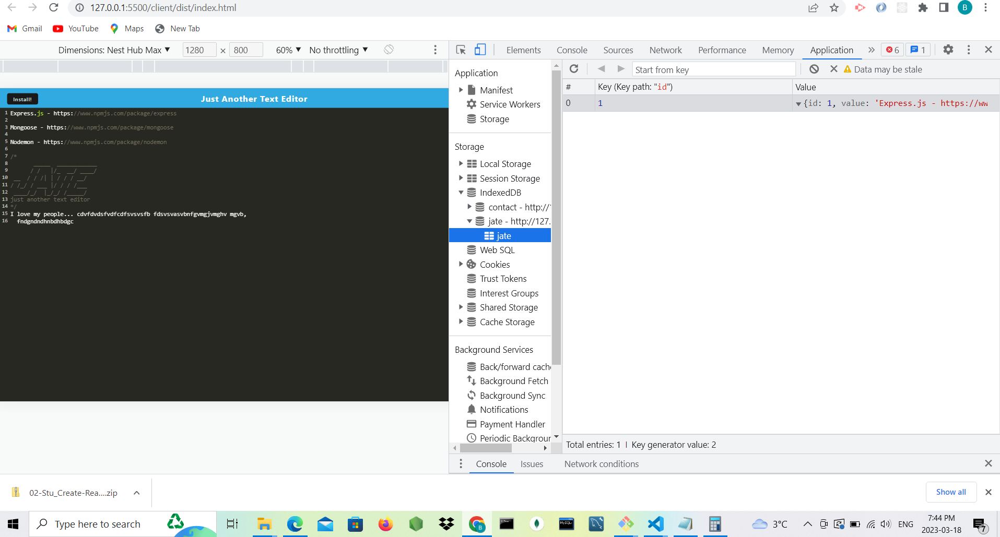

# Progressive Web Applications (PWA): Text Editor

The goal of the assignment is to build a text editor that can either run online or offline in the browser. When the application is run at the terminal, a package called IndexedDB API is implemented at the backend of the application which is used to store and retrieve data for the users. When the users inputted data in the text editor the data will be saved automatically inside indexedDb which serves as a storage location. When the editor is closed and reopen, the data will display back inside the text editor. Equally, the browser can be installed as an icon on the desktop making it to behave like a normal mobile app.

 ## Installed Packages

Express.js - https://www.npmjs.com/package/express

Nodemon - https://www.npmjs.com/package/nodemon

IndexedDb - https://www.npmjs.com/package/idb

## Generated images

## URL of the GitHub repository

https://github.com/Bamidele100/text-editor-app.git

## walkthrough video

